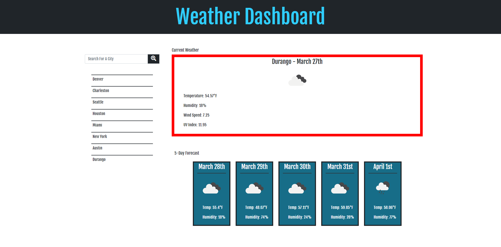

# Weather-Dashboard

## What was the Weather Dashboard Project about?

For this project, we were tasked with creating a weather website using the Open Weather API that would show the current weather, UV index, and then the weather for the next 5 days as well. The client also wanted an indicator of some sort to show whether or not the UV index had favorable conditions.

## How did I do it?

I pulled the information from the OpenWeather website and targeted the specific information that I needed. I then appended everything to the page to resemble the mock-up that we were provided.  For the UV index, I chose to create the entire border to indicate whether or not there were favorable conditions in the area.  As the user continues to search for cities, the searched cities will append to the page.  On refresh, only the most recent will show.

## Example of what the Weather Dashboard looks like

## Try it out here!

https://k-ryanhunt.github.io/Weather-Dashboard/